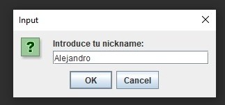
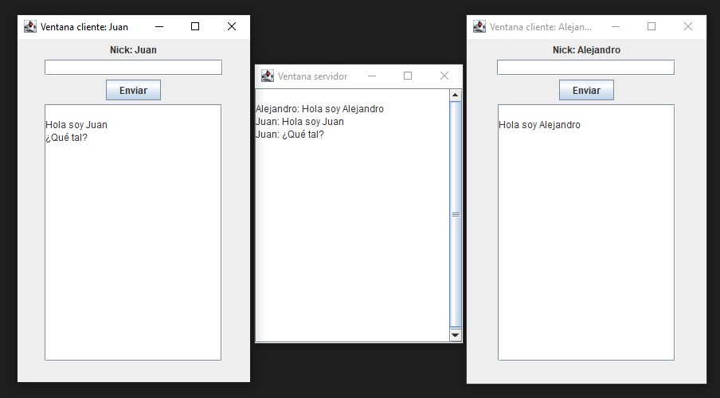

# Aplicación Chat

## Descripción
Práctica de chat/notificaciones en tiempo real, donde tenemos un servidor, y podemos crear varios clientes con diferentes nombres.

Requisitos de la práctica:
- Los usuarios no verán los mensajes del resto de usuarios.
- La entrada de incidencia de los usuarios se hará a través de teclado.
- El servidor recibirá todos los mensajes de los usuarios.
- Los mensajes los verá el servidor por orden de llegada e identificando a qué usuario pertence.
- El servidor NO responderá a los usuarios, solo puede leer los mensajes. 

## Creado con
- [Eclipse](https://www.eclipse.org/downloads/)
- [Java](https://www.java.com/es/download/)

## Capturas de pantalla
Al iniciar el cliente nos pedirá que ingresemos un nombre de usuario para conectarnos.

Aplicación con el servidor y dos usuarios conectados.

## Autores
- Alejandro Cea
